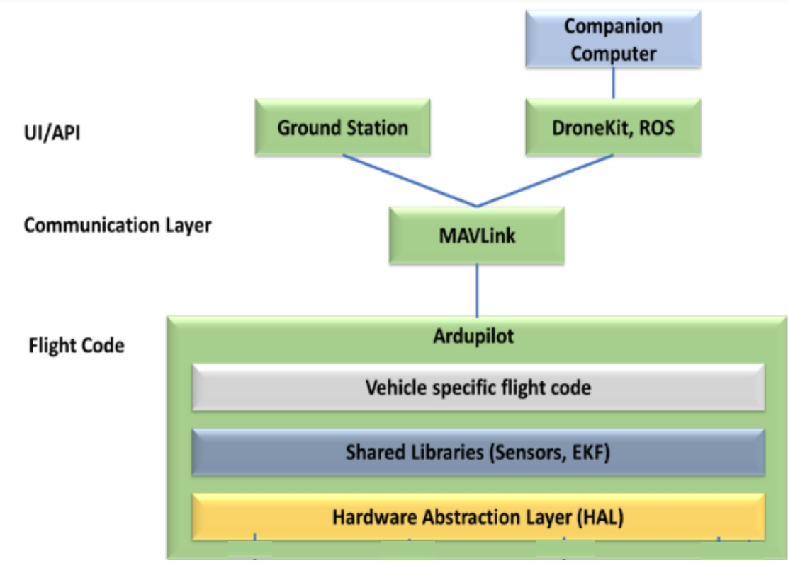

# UAV_MTech

The repository functions as a pedagogical and installation handbook for the manifold modules designed for the Unmanned Aerial Vehicle (UAV) course.
The quadcopter simulation platform, alternatively known as the Software In The Loop (SITL) implemented in this course, is Arducopter SITL integrated with Dronkit and Robot Operating System (ROS) as independent Application Programming Interfaces (APIs) to program intelligent flight maneuvers, and develop artificial intelligence (AI) capabilities using computer vision and machine learning techniques.

Additionally, a general-purpose open-source ground control station, which facilitates essential drone parameter configuration and waypoint navigation via a Graphical User Interface (GUI)-based desktop application, is also included in this course and installation procedure. 

The general functional architecture of the entire setup is given in the figure below 

## Installations

1. [ Ardupilot and MAV Proxy ](https://github.com/2ashishmohan/UAV_MTech/blob/main/Ardupilot%20and%20MAVProxy.md)

ArduPilot is an open-source autopilot software suite designed to control unmanned aerial vehicles (UAVs). It is compatible with a wide range of hardware platforms and features a rich set of features for autonomous flight, including GPS-based navigation, waypoint following, and advanced control algorithms. ArduPilot is highly customizable, allowing users to modify the code to suit their specific needs.

MAVProxy (MAVLink Proxy) is a lightweight communication tool for drones that allows for real-time monitoring and control of UAVs. It acts as a bridge between the ground control station (GCS) and the UAV, forwarding MAVLink messages between the two. MAVProxy can be used to control UAVs directly from the command line or via a GUI, and supports a range of GCSs and UAV platforms.

Together, ArduPilot and MAVProxy form a powerful combination for autonomous drone operation. ArduPilot provides the underlying autopilot functionality, while MAVProxy allows for real-time monitoring and control of the UAV. This combination allows users to execute complex autonomous flight missions while retaining full control over the drone in case manual intervention is required.

2.  [ Gazebo and Ardupilot Plugin](https://github.com/2ashishmohan/UAV_MTech/blob/main/Gazebo%20and%20ArduPilot%20Plugin.md)

Gazebo is a popular open-source simulation environment used for simulating robots, unmanned vehicles, and other autonomous systems. It provides a platform for testing and evaluating the performance of algorithms and control systems in a simulated environment before deployment in the real world.

The ArduPilot Gazebo plugin allows users to simulate ArduPilot-based vehicles in Gazebo. The plugin provides a bridge between the ArduPilot software and the Gazebo simulation environment, allowing users to test and evaluate their control algorithms in a simulated environment. By integrating ArduPilot with Gazebo, developers can test and refine their autonomous vehicle control algorithms in a realistic environment, without the need for physical hardware. This can greatly reduce the cost and time required for development, testing, and evaluation of autonomous vehicles.

3. [ QGroundControl - GCS](https://github.com/2ashishmohan/UAV_MTech/blob/main/QGroundControl%20Installation.md)

QGroundControl provides full flight control and vehicle setup for PX4 or ArduPilot powered vehicles. It provides easy and straightforward usage for beginners, while still delivering high end feature support for experienced users.
### Key Features:

- Full setup/configuration of ArduPilot and PX4 Pro powered vehicles.
- Flight support for vehicles running PX4 and ArduPilot (or any other autopilot that communicates using the MAVLink protocol).
- Mission planning for autonomous flight.
- Flight map display showing vehicle position, flight track, waypoints and vehicle instruments.
- Video streaming with instrument display overlays.
- Support for managing multiple vehicles.
- QGC runs on Windows, OS X, Linux platforms, iOS and Android devices.

for more detailed information please visit http://qgroundcontrol.com/

4. [ Dronekit Python](https://github.com/2ashishmohan/UAV_MTech/blob/main/Dronekit%20Python.md)

DroneKit is an open-source software development kit (SDK) that enables developers to create drone applications using Python programming language. The SDK is built on top of the MAVLink protocol, which is a lightweight messaging protocol designed for communication between unmanned vehicles and ground control stations.

DroneKit provides a high-level API for controlling and monitoring drones, including features such as vehicle control, mission planning, telemetry monitoring, and data logging. It can be used with a wide range of popular drone platforms, including DJI, 3DR, and Pixhawk.
